# Final Project Aplikasi Berbasis Laravel - Dokumentasi API

## Identitas Mahasiswa

- **Nama:** Putu Rion Aditya Gunawan
- **NIM:** 2415354066
- **Kelas/Rombel:** TRPL 4B
- **Tanggal Praktikum:** 25 Mei 2026

---

## Teknologi & Tools yang Digunakan

- **Sistem Operasi:** Windows 11
- **Bahasa Pemrograman:** PHP (Laravel Framework)
- **Database:** MySQL / phpMyAdmin
- **Tools Pengujian API:** Thunder Client / Postman
- **Code Editor & Version Control:** VS Code & Git

---

## Daftar Endpoint API

### A. Modul Customer

| No | HTTP Method | Endpoint | Deskripsi | Status Dokumentasi |
|:--:|:-----------:|:---------|:----------|:------------------:|
| 1 | `GET` | `/customers/{id}` | Mengambil detail data satu pelanggan berdasarkan ID | [ ] Selesai |
| 2 | `POST` | `/customers` | Menambahkan data pelanggan baru ke dalam database | [ ] Selesai |
| 3 | `PUT` | `/customers/{id}` | Memperbarui keseluruhan data pelanggan berdasarkan ID | [ ] Selesai |
| 4 | `DELETE` | `/customers/{id}` | Menghapus data pelanggan dari database | [ ] Selesai |

### B. Modul Service

| No | HTTP Method | Endpoint | Deskripsi | Status Dokumentasi |
|:--:|:-----------:|:---------|:----------|:------------------:|
| 5 | `GET` | `/services/{id}` | Mengambil detail data layanan berdasarkan ID | [ ] Selesai |
| 6 | `POST` | `/services` | Menambahkan jenis layanan baru | [ ] Selesai |
| 7 | `PUT` | `/services/{id}` | Memperbarui data layanan yang sudah ada berdasarkan ID | [ ] Selesai |
| 8 | `DELETE` | `/services/{id}` | Menghapus data layanan dari sistem | [ ] Selesai |

### C. Modul Subscription

| No | HTTP Method | Endpoint | Deskripsi | Status Dokumentasi |
|:--:|:-----------:|:---------|:----------|:------------------:|
| 9 | `GET` | `/subscriptions` | Mengambil semua daftar *subscription* yang ada di sistem | [ ] Selesai |
| 10 | `GET` | `/subscriptions/{id}` | Mengambil detail satu data *subscription* berdasarkan ID | [ ] Selesai |
| 11 | `POST` | `/subscriptions` | Membuat data *subscription* baru untuk *customer* | [ ] Selesai |
| 12 | `PATCH` | `/subscriptions/{id}/change-status` | Memperbarui status *subscription* | [ ] Selesai |

---

## Langkah-Langkah Pengujian Endpoint

1. Pastikan *local server* database (MySQL via phpMyAdmin/XAMPP/Laragon) sudah aktif.
2. Jalankan perintah `php artisan serve` pada terminal VS Code untuk mengaktifkan server lokal Laravel.
3. Buka ekstensi **Thunder Client** di VS Code.
4. Masukkan URL endpoint (sesuaikan domain lokal/port, misalnya: `http://localhost:8000` atau dengan tambahan *prefix* `/api` jika diatur di `api.php`).
5. Pilih HTTP Method yang sesuai, isi *Request Body* (jika bertipe POST/PUT/PATCH), lalu klik **Send**.
6. Ambil screenshot hasil *Response Body* beserta *HTTP Status Code*-nya untuk dokumentasi di bawah ini.

---

## Dokumentasi Hasil Pengujian (Screenshot)

*(Ganti teks placeholder di bawah dengan tag gambar atau screenshot dari Thunder Client)*

### Modul Customer

#### 1. Get Single Customer (`GET /customers/{id}`)
> 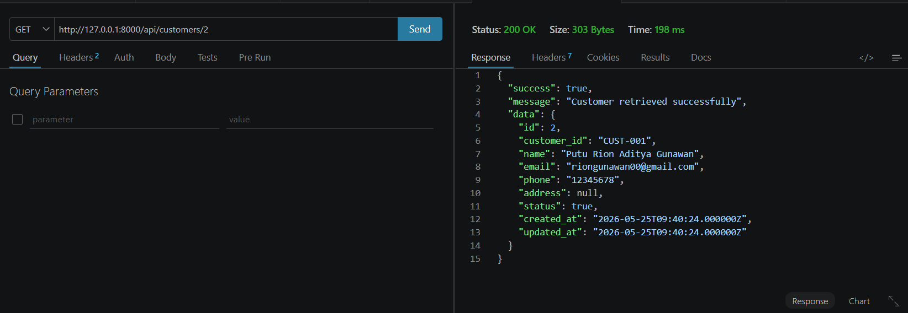

#### 2. Create Customer (`POST /customers`)
> 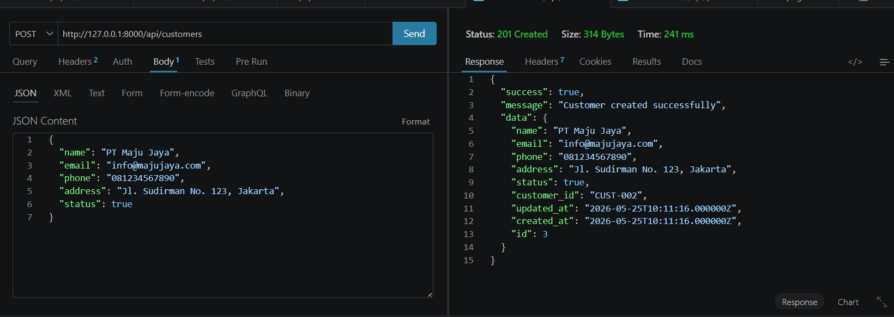

#### 3. Update Customer (`PUT /customers/{id}`)
> 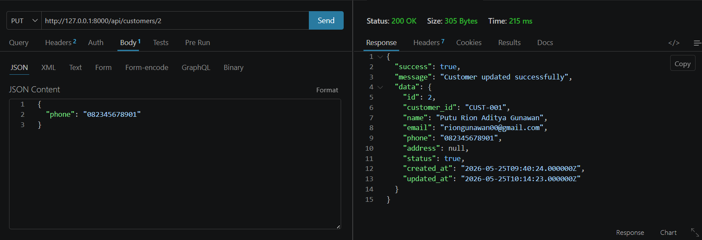

#### 4. Delete Customer (`DELETE /customers/{id}`)
> 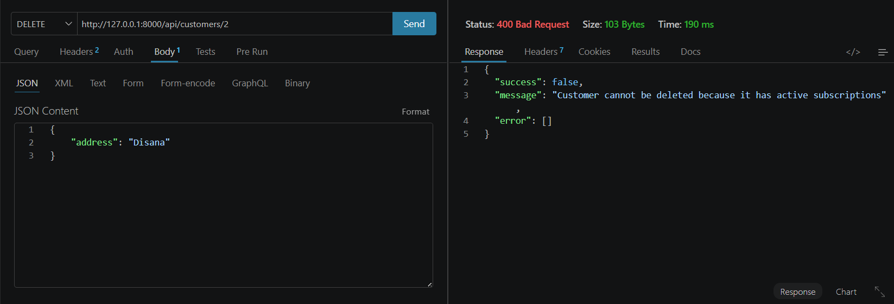

---

### Modul Service

#### 5. Get Single Service (`GET /services/{id}`)
> 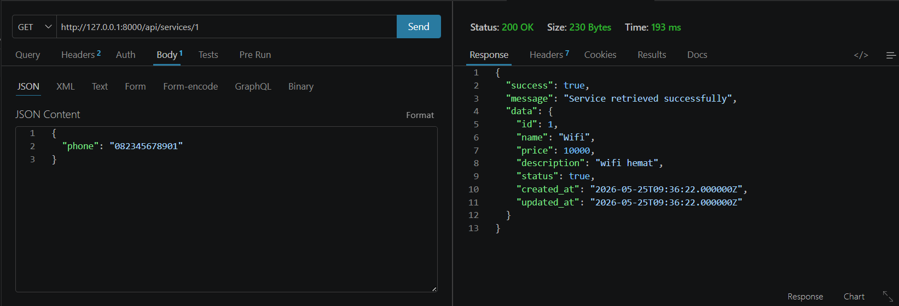

#### 6. Create Service (`POST /services`)
> 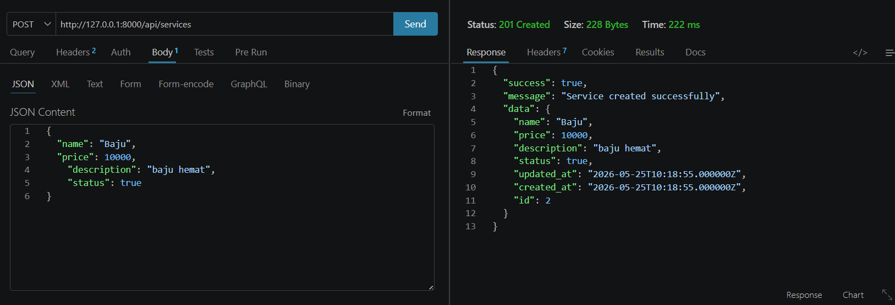

#### 7. Update Service (`PUT /services/{id}`)
> 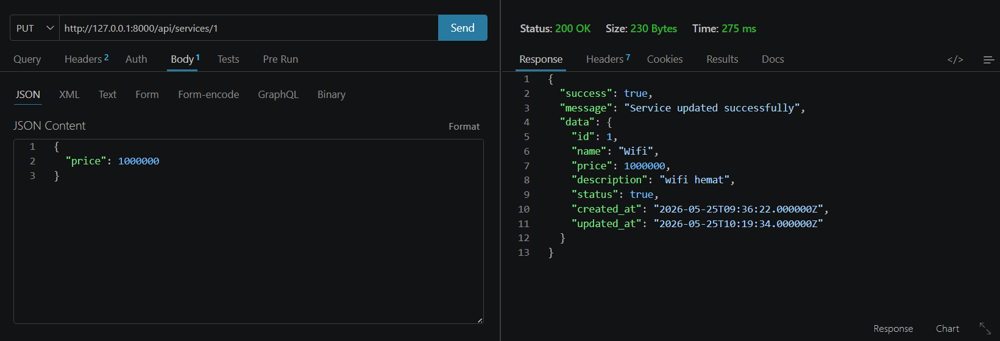

#### 8. Delete Service (`DELETE /services/{id}`)
> 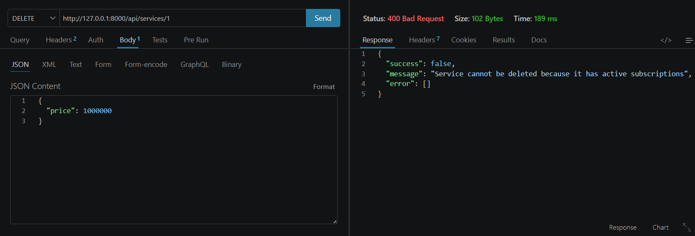

---

### Modul Subscription

#### 9. Get All Subscriptions (`GET /subscriptions`)
> 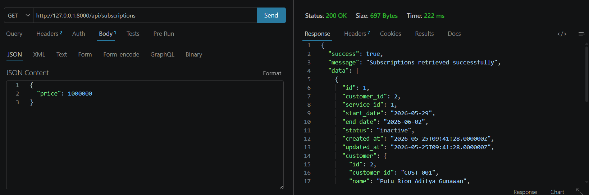

#### 10. Get Single Subscription (`GET /subscriptions/{id}`)
> 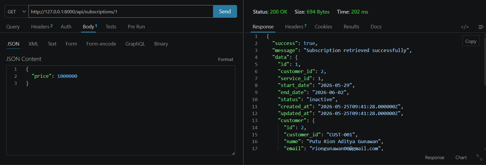

#### 11. Create Subscription (`POST /subscriptions`)
> 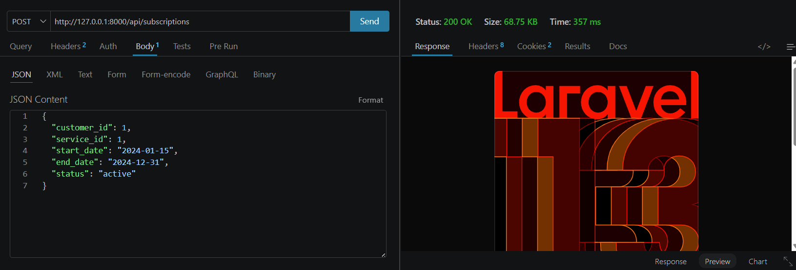

#### 12. Change Subscription Status (`PATCH /subscriptions/{id}/change-status`)
> 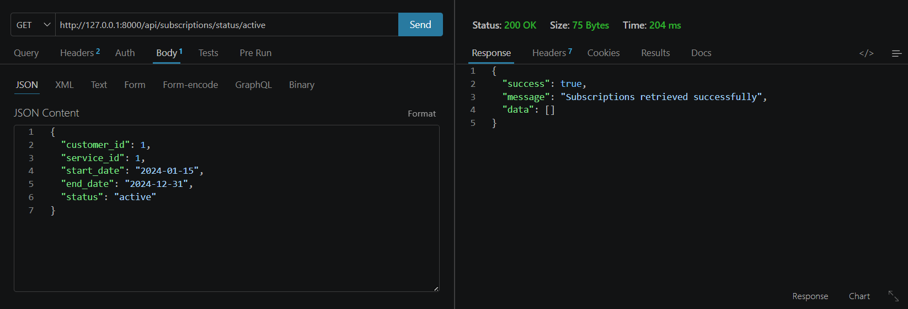